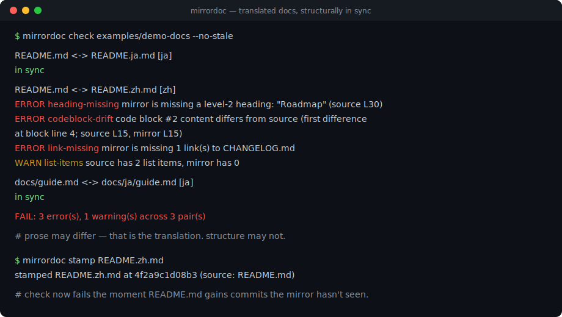
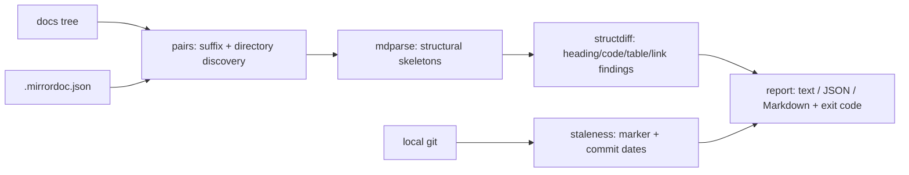

# mirrordoc

[English](README.md) | [中文](README.zh.md) | [日本語](README.ja.md)

[](LICENSE) [](CHANGELOG.md) [](pyproject.toml)  [](CONTRIBUTING.md)

**翻訳版 Markdown のためのオープンソースな同期ゲート——オフラインの構造差分と git 駆動の陳腐化検出で、バイリンガル README が静かに腐るのを止める。**



```bash
git clone https://github.com/JaydenCJ/mirrordoc && cd mirrordoc && pip install -e .
```

> **プレリリース：** mirrordoc はまだ PyPI に公開されていません。最初のリリースまでは [JaydenCJ/mirrordoc](https://github.com/JaydenCJ/mirrordoc) をクローンし、リポジトリのルートで `pip install -e .` を実行してください。

## なぜ mirrordoc？

翻訳ドキュメントの腐り方は具体的で、しかも無音です。英語の README にセクションやフラグ、修正済みの例が追加されても、`README.ja.md` は古い事実を配り続け、どこのチェックも失敗しません。翻訳プラットフォームはサーバー・アカウント・webhook でこれを解決しますが、翻訳が git 内のただのファイルであるリポジトリには、それこそが不適切です。mirrordoc はオフラインの代替手段です。両ファイルを構造スケルトン（見出し、コードブロック、表、リンク、画像）に解析してスケルトン同士を差分し——本文は自由に異なってよく、それこそが翻訳です——正典ファイルにミラーが見ていないコミットがあるかを git に問い合わせます。コマンド一つ、ドリフト検出で終了コード 1、ネットワークなし、アカウントなし、ホストするものは何もありません。

|  | mirrordoc | Crowdin | Weblate | po4a |
|---|---|---|---|---|
| オフラインで動作、サーバーもアカウントも不要 | はい | いいえ | 自前サーバーが必要 | はい |
| ドキュメントは git 内の素の Markdown のまま | はい | プラットフォーム側コピー | プラットフォーム側コピー | Gettext PO ファイル |
| 構造ゲート（見出し/コード/表/リンク） | はい | — | — | — |
| git コミットに固定された陳腐化検出 | はい | 同期ステータス | 同期ステータス | 段落ごとのハッシュ |
| CI 向け終了コード + JSON/Markdown レポート | はい | API 経由 | API 経由 | 一部 |
| 機械翻訳 / 翻訳メモリ | いいえ——検査のみ | はい | はい | アドオン経由 |
| ランタイム依存 | 0 | SaaS | 約 100 の Python パッケージ | Perl ツールチェーン |

<sub>範囲の注記：Crowdin/Weblate は*翻訳作業*を管理し、mirrordoc は CI で*翻訳結果*を関所化します。どれとも補完関係です。依存数は 2026-07 時点：Weblate 5.x は約 100 の Python 依存を宣言、po4a は Perl 環境が必要。mirrordoc は [pyproject.toml](pyproject.toml) の `dependencies = []` です。</sub>

## 特長

- **本文ではなく構造を見る** —— 見出し、フェンス付きコードブロック、表、リンク、画像、リスト項目は一致必須。翻訳された文章がゲートに引っかかることはありません（[docs/structure-model.md](docs/structure-model.md)）。
- **コードブロックはバイト単位で一致** —— 「翻訳」された例はドリフトであり、最初に異なる行番号つきで報告。`--lax-code` は内容比較を緩めつつ、個数と言語表記は検査し続けます。
- **二つの陳腐化シグナル** —— `mirrordoc stamp` のマーカーがミラーをソースのコミットに固定（以後のソースコミットはエラー）。マーカーがなければコミット日付比較（警告）にフォールバック。
- **規約ベースの自動発見** —— `README.zh.md` 型と `docs/ja/guide.md` 型を自動検出し、実在の ISO 639-1 コードで検証するため `README.old.md` が「翻訳」扱いされることはありません。`.mirrordoc.json` で明示ペアも可能。
- **翻訳を理解した寛容さ** —— アンカーの slug（`#安装`）やローカライズ済みリンク（`CHANGELOG.md` に対する `CHANGELOG.zh.md`）は設計上等価。忠実なミラーは例外設定なしで通ります。
- **三つの決定的フォーマット** —— ターミナル向けの整列テキスト、ツール向けのスキーマ版付き JSON、PR コメントにそのまま貼れる Markdown 断片。三者の判定は常に同一。
- **依存ゼロ、ネットワークゼロ** —— Python ≥ 3.9 の純標準ライブラリ。起動される外部プロセスはローカルの `git` だけです。

## クイックスタート

インストール：

```bash
git clone https://github.com/JaydenCJ/mirrordoc && cd mirrordoc && pip install -e .
```

リポジトリには、忠実なミラーと静かに腐ったミラーを含むデモ用ドキュメントツリーが同梱されています：

```bash
mirrordoc check examples/demo-docs --no-stale
```

```text
README.md <-> README.ja.md [ja]
  in sync

README.md <-> README.zh.md [zh]
  ERROR heading-missing        mirror is missing a level-2 heading: "Roadmap" (source L30)
  ERROR codeblock-drift        code block #2 content differs from source (first difference at block line 4; source L15, mirror L15)
  ERROR link-missing           mirror is missing 1 link(s) to CHANGELOG.md
  WARN  list-items             source has 2 list items, mirror has 0

docs/guide.md <-> docs/ja/guide.md [ja]
  in sync

FAIL: 3 error(s), 1 warning(s) across 3 pair(s)
```

終了コードは 1——中国語ミラーは Roadmap 節を訳しておらず、サンプルコードをローカライズし、リンクを一つ落としています。自分のリポジトリでは翻訳後に各ミラーへスタンプを押し、鮮度の証明は git に運ばせましょう：

```bash
mirrordoc stamp README.zh.md     # writes <!-- mirrordoc: source=README.md commit=… -->
mirrordoc check .                # exit 1 once README.md gains commits the mirror hasn't seen
```

## コマンドと終了コード

| コマンド | 役割 | ネットワーク |
|---|---|---|
| `mirrordoc check [ROOT]` | ペアを発見し、構造 + 陳腐化を関所化 | なし |
| `mirrordoc diff SRC MIRROR` | 明示した一組の構造のみを比較 | なし |
| `mirrordoc pairs [ROOT]` | 発見した（ソース、ミラー、言語）の組を列挙 | なし |
| `mirrordoc outline FILE…` | エンジンが見ている骨格を表示 | なし |
| `mirrordoc stamp MIRROR` | ミラーをソースの現在のコミットに固定 | なし |

終了コード：`0` 同期、`1` ドリフトまたは陳腐化を検出、`2` 用法/設定エラー。主なフラグ：`--format text|json|markdown`、`--strict`（警告も失敗に）、`--langs zh,ja`、`--no-stale`、`--lax-code`、`--require-marker`。

## 設定

| キー | デフォルト | 効果 |
|---|---|---|
| `langs` | `[]` | 検査対象をこれらの言語サブタグに限定 |
| `exclude` | `[]` | スキップする fnmatch グロブ（意図的にドリフトさせた fixture、vendor 文書） |
| `pairs` | `[]` | 規約外の明示的な `{source, mirror, lang}` エントリ |
| `ignore_links` | `[]` | 比較を免除するリンク URL のグロブ |
| `compare_code_content` | `true` | コードブロックのバイト単位一致を要求 |
| `check_anchors` | `false` | `#fragment` リンクも比較（オフ：翻訳で slug が変わるため） |
| `check_staleness` | `true` | git 鮮度チェックを実行 |
| `require_marker` | `false` | 同期マーカーのないミラーを失敗にする |

設定はスキャン対象ルートの `.mirrordoc.json`（または `--config FILE`）に置きます。未知のキーは拒否されます。本リポジトリは自身の [.mirrordoc.json](.mirrordoc.json) で自分を関所化しており、いま読んでいる三つの README は、それらが解説するツール自身によって検査されています。

## 検証

このリポジトリは CI を同梱しません。上記の主張はすべてローカル実行で検証されています。このリポジトリのチェックアウトから再現できます：

```bash
pip install -e '.[dev]' && pytest && bash scripts/smoke.sh
```

出力（実際の実行からの写し、`...` で省略）：

```text
90 passed in 2.91s
...
[stale] FAIL: 1 error(s), 0 warning(s) across 1 pair(s)
...
SMOKE OK
```

## アーキテクチャ



## ロードマップ

- [x] 構造パーサ、スケルトン差分、ペア発見、同期マーカー、git 陳腐化検出、三つのレポート形式、`check`/`diff`/`pairs`/`outline`/`stamp` CLI（v0.1.0）
- [ ] PyPI 公開、`pip install mirrordoc` 対応
- [ ] `mirrordoc todo`：スタンプ以降に変わったソースの hunk をミラーごとに列挙（`git diff` の切り出し）
- [ ] pre-commit フックのレシピと、Markdown レポートの PR コメントヘルパー
- [ ] 変更のない節をレビューで飛ばせる、節ごとの指紋（オプション）

全リストは [open issues](https://github.com/JaydenCJ/mirrordoc/issues) を参照してください。

## コントリビュート

貢献を歓迎します——まずは [good first issue](https://github.com/JaydenCJ/mirrordoc/issues?q=is%3Aissue+is%3Aopen+label%3A%22good+first+issue%22) から、または [discussion](https://github.com/JaydenCJ/mirrordoc/discussions) を立ててください。開発環境の構築は [CONTRIBUTING.md](CONTRIBUTING.md) を参照。

## ライセンス

[MIT](LICENSE)
