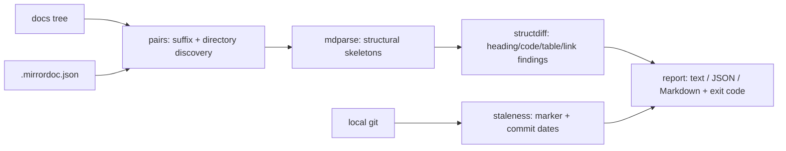

# mirrordoc

[English](README.md) | [中文](README.zh.md) | [日本語](README.ja.md)

[](LICENSE) [](CHANGELOG.md) [](pyproject.toml)  [](CONTRIBUTING.md)

**Open-source parity gate for translated Markdown — an offline structure differ plus git-powered staleness checks, so bilingual READMEs stop rotting silently.**


```bash
git clone https://github.com/JaydenCJ/mirrordoc && cd mirrordoc && pip install -e .
```

> **Pre-release:** mirrordoc is not yet published to PyPI. Until the first release, clone [JaydenCJ/mirrordoc](https://github.com/JaydenCJ/mirrordoc) and run `pip install -e .` from the repository root.

## Why mirrordoc?

Translated docs rot in a specific, silent way: the English README gains a section, a flag, a corrected example — and `README.zh.md` keeps shipping the old truth, with no failing check anywhere. Translation platforms solve this with servers, accounts, and webhooks, which is exactly wrong for a repo whose translations are just files in git. mirrordoc is the offline alternative: it parses both files into a structural skeleton (headings, code blocks, tables, links, images), diffs the skeletons — prose is free to differ, that *is* the translation — and asks git whether the canonical file has commits the mirror has never seen. One command, exit code 1 on drift, no network, no account, nothing to host.

|  | mirrordoc | Crowdin | Weblate | po4a |
|---|---|---|---|---|
| Works offline, no server or account | Yes | No | Self-hosted server | Yes |
| Docs stay plain Markdown in git | Yes | Platform copy | Platform copy | Gettext PO files |
| Structure gate (headings/code/tables/links) | Yes | — | — | — |
| Staleness pinned to git commits | Yes | Sync status | Sync status | Per-paragraph hashes |
| CI-friendly exit codes + JSON/Markdown report | Yes | Via API | Via API | Partial |
| Machine translation / translation memory | No — checks only | Yes | Yes | Via addons |
| Runtime dependencies | 0 | SaaS | ~100 Python pkgs | Perl toolchain |

<sub>Scope note: Crowdin/Weblate manage the *translating*; mirrordoc gates the *result* in CI and is complementary to any of them. Dependency counts as of 2026-07: Weblate 5.x declares ~100 Python requirements, po4a requires a Perl installation; mirrordoc's count is `dependencies = []` in [pyproject.toml](pyproject.toml).</sub>

## Features

- **Structure, not prose** — headings, fenced code blocks, tables, links, images, and list items must match; translated text never trips the gate ([docs/structure-model.md](docs/structure-model.md)).
- **Byte-identical code blocks** — a "translated" example is drift, reported with the first differing line; `--lax-code` relaxes content while still checking count and language.
- **Two staleness signals** — a `mirrordoc stamp` marker pins the mirror to the source's commit (later source commits are an error), with a commit-date fallback (warning) when no marker exists.
- **Convention-based discovery** — `README.zh.md` and `docs/ja/guide.md` styles found automatically, validated against real ISO 639-1 codes so `README.old.md` is never a "translation"; explicit pairs via `.mirrordoc.json`.
- **Translation-aware leniency** — anchor slugs (`#安装`) and localized links (`CHANGELOG.zh.md` for `CHANGELOG.md`) are equivalent by design, so faithful mirrors pass without escape hatches.
- **Three deterministic formats** — aligned text for terminals, schema-versioned JSON for tooling, and a Markdown fragment ready to paste into a PR comment; identical verdicts in all three.
- **Zero dependencies, zero network** — pure standard library on Python ≥ 3.9; the only external process ever spawned is your local `git`.

## Quickstart

Install:

```bash
git clone https://github.com/JaydenCJ/mirrordoc && cd mirrordoc && pip install -e .
```

The repository ships a demo docs tree with one faithful mirror and one that has quietly rotted:

```bash
mirrordoc check examples/demo-docs --no-stale
```

```text
README.md <-> README.ja.md [ja]
  in sync

README.md <-> README.zh.md [zh]
  ERROR heading-missing        mirror is missing a level-2 heading: "Roadmap" (source L30)
  ERROR codeblock-drift        code block #2 content differs from source (first difference at block line 4; source L15, mirror L15)
  ERROR link-missing           mirror is missing 1 link(s) to CHANGELOG.md
  WARN  list-items             source has 2 list items, mirror has 0

docs/guide.md <-> docs/ja/guide.md [ja]
  in sync

FAIL: 3 error(s), 1 warning(s) across 3 pair(s)
```

Exit code 1 — the Chinese mirror never translated the Roadmap section, localized a code sample, and dropped a link. In your own repo, pin each mirror after translating and let git carry the freshness proof:

```bash
mirrordoc stamp README.zh.md     # writes <!-- mirrordoc: source=README.md commit=… -->
mirrordoc check .                # exit 1 once README.md gains commits the mirror hasn't seen
```

## Commands and exit codes

| Command | Does | Network |
|---|---|---|
| `mirrordoc check [ROOT]` | discover pairs, gate structure + staleness | none |
| `mirrordoc diff SRC MIRROR` | gate one explicit pair, structure only | none |
| `mirrordoc pairs [ROOT]` | list discovered (source, mirror, lang) triples | none |
| `mirrordoc outline FILE…` | print the skeleton the engine sees | none |
| `mirrordoc stamp MIRROR` | pin the mirror to the source's current commit | none |

Exit codes: `0` in sync, `1` drift or staleness found, `2` usage/configuration error. Common flags: `--format text|json|markdown`, `--strict` (warnings fail), `--langs zh,ja`, `--no-stale`, `--lax-code`, `--require-marker`.

## Configuration

| Key | Default | Effect |
|---|---|---|
| `langs` | `[]` | restrict checking to these language subtags |
| `exclude` | `[]` | fnmatch globs to skip (deliberately drifted fixtures, vendored docs) |
| `pairs` | `[]` | explicit `{source, mirror, lang}` entries beyond the conventions |
| `ignore_links` | `[]` | link-URL globs exempt from comparison |
| `compare_code_content` | `true` | require code blocks to be byte-identical |
| `check_anchors` | `false` | also compare `#fragment` links (off: translated slugs differ) |
| `check_staleness` | `true` | run the git freshness checks |
| `require_marker` | `false` | fail mirrors that carry no sync marker |

Settings live in `.mirrordoc.json` at the scanned root (or `--config FILE`); unknown keys are rejected. This repository gates itself with its own [.mirrordoc.json](.mirrordoc.json) — the three READMEs you are reading are checked by the tool they document.

## Verification

This repository ships no CI; every claim above is verified by local runs. Reproduce them from a checkout of this repository:

```bash
pip install -e '.[dev]' && pytest && bash scripts/smoke.sh
```

Output (copied from a real run, truncated with `...`):

```text
90 passed in 2.91s
...
[stale] FAIL: 1 error(s), 0 warning(s) across 1 pair(s)
...
SMOKE OK
```

## Architecture



## Roadmap

- [x] Structural parser, skeleton differ, pair discovery, sync markers, git staleness, three report formats, `check`/`diff`/`pairs`/`outline`/`stamp` CLI (v0.1.0)
- [ ] PyPI release with `pip install mirrordoc`
- [ ] `mirrordoc todo`: per-mirror list of source hunks changed since the stamp (`git diff` slicing)
- [ ] Pre-commit hook recipe and a PR-comment helper for the Markdown report
- [ ] Optional per-section fingerprints so unchanged sections can be skipped in review

See the [open issues](https://github.com/JaydenCJ/mirrordoc/issues) for the full list.

## Contributing

Contributions are welcome — start with a [good first issue](https://github.com/JaydenCJ/mirrordoc/issues?q=is%3Aissue+is%3Aopen+label%3A%22good+first+issue%22) or open a [discussion](https://github.com/JaydenCJ/mirrordoc/discussions). See [CONTRIBUTING.md](CONTRIBUTING.md) for the development setup.

## License

[MIT](LICENSE)
