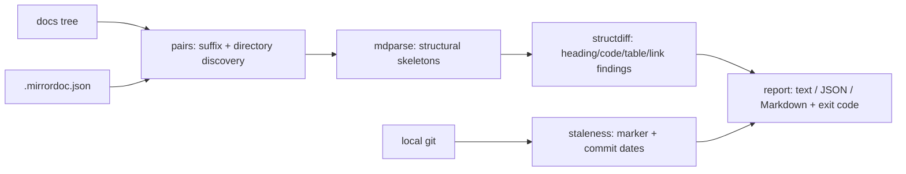

# mirrordoc

[English](README.md) | [中文](README.zh.md) | [日本語](README.ja.md)

[](LICENSE) [](CHANGELOG.md) [](pyproject.toml)  [](CONTRIBUTING.md)

**面向翻译版 Markdown 的开源一致性关卡——离线的结构差异比对，加上由 git 驱动的过期检测，让双语 README 不再悄悄腐烂。**


```bash
git clone https://github.com/JaydenCJ/mirrordoc && cd mirrordoc && pip install -e .
```

> **预发布：** mirrordoc 尚未发布到 PyPI。在首个正式版本之前，请克隆 [JaydenCJ/mirrordoc](https://github.com/JaydenCJ/mirrordoc) 并在仓库根目录运行 `pip install -e .`。

## 为什么选 mirrordoc？

翻译文档的腐烂方式非常具体且无声：英文 README 新增了一个章节、一个参数、一处修正过的示例——而 `README.zh.md` 仍在传播旧的事实，任何地方都没有失败的检查。翻译平台用服务器、账号和 webhook 来解决这个问题，而对于翻译本身就是 git 里的普通文件的仓库，这恰恰是错误的方案。mirrordoc 是离线的替代品：它把两个文件解析成结构骨架（标题、代码块、表格、链接、图片），对骨架做差异比对——正文可以自由不同，那*正是*翻译——再询问 git 规范文件是否有镜像从未见过的提交。一条命令，发现漂移即退出码 1，无网络、无账号、无需部署任何东西。

|  | mirrordoc | Crowdin | Weblate | po4a |
|---|---|---|---|---|
| 离线可用，无服务器无账号 | 是 | 否 | 需自建服务器 | 是 |
| 文档保持为 git 里的纯 Markdown | 是 | 平台副本 | 平台副本 | Gettext PO 文件 |
| 结构关卡（标题/代码/表格/链接） | 是 | — | — | — |
| 过期检测锚定到 git 提交 | 是 | 同步状态 | 同步状态 | 按段落哈希 |
| 适配 CI 的退出码 + JSON/Markdown 报告 | 是 | 经 API | 经 API | 部分 |
| 机器翻译 / 翻译记忆 | 否——只做检查 | 是 | 是 | 经插件 |
| 运行时依赖 | 0 | SaaS | 约 100 个 Python 包 | Perl 工具链 |

<sub>范围说明：Crowdin/Weblate 管理*翻译过程*；mirrordoc 在 CI 中把关*翻译结果*，与它们互补。依赖数量截至 2026-07：Weblate 5.x 声明约 100 个 Python 依赖，po4a 需要 Perl 环境；mirrordoc 的数量是 [pyproject.toml](pyproject.toml) 中的 `dependencies = []`。</sub>

## 特性

- **只看结构，不看正文** —— 标题、围栏代码块、表格、链接、图片和列表项必须一致；翻译后的文字永远不会触发关卡（[docs/structure-model.md](docs/structure-model.md)）。
- **代码块须逐字节一致** —— 被"翻译"的示例即是漂移，报告会给出首个不同的行号；`--lax-code` 放宽内容比对，但仍检查数量与语言标注。
- **两种过期信号** —— `mirrordoc stamp` 标记把镜像锚定到源文件的提交（源文件其后的提交即为错误），无标记时回退到提交日期比较（警告）。
- **按约定自动发现** —— 自动找到 `README.zh.md` 与 `docs/ja/guide.md` 两种风格，并用真实 ISO 639-1 代码校验，`README.old.md` 绝不会被当成"翻译"；`.mirrordoc.json` 可显式配对。
- **懂翻译的宽容** —— 锚点 slug（`#安装`）与本地化链接（用 `CHANGELOG.zh.md` 对应 `CHANGELOG.md`）在设计上等价，忠实的镜像无需任何豁免即可通过。
- **三种确定性输出** —— 终端用的对齐文本、供工具消费的带 schema 版本的 JSON、可直接粘进 PR 评论的 Markdown 片段；三者结论完全一致。
- **零依赖、零网络** —— Python ≥ 3.9 纯标准库；唯一会启动的外部进程是你本地的 `git`。

## 快速上手

安装：

```bash
git clone https://github.com/JaydenCJ/mirrordoc && cd mirrordoc && pip install -e .
```

仓库自带一棵演示文档树，包含一个忠实镜像和一个已悄悄腐烂的镜像：

```bash
mirrordoc check examples/demo-docs --no-stale
```

```text
README.md <-> README.ja.md [ja]
  in sync

README.md <-> README.zh.md [zh]
  ERROR heading-missing        mirror is missing a level-2 heading: "Roadmap" (source L30)
  ERROR codeblock-drift        code block #2 content differs from source (first difference at block line 4; source L15, mirror L15)
  ERROR link-missing           mirror is missing 1 link(s) to CHANGELOG.md
  WARN  list-items             source has 2 list items, mirror has 0

docs/guide.md <-> docs/ja/guide.md [ja]
  in sync

FAIL: 3 error(s), 1 warning(s) across 3 pair(s)
```

退出码为 1——中文镜像一直没有翻译 Roadmap 章节、本地化了一段示例代码，还丢了一个链接。在你自己的仓库里，翻译完成后为每个镜像盖章，让 git 承载新鲜度证明：

```bash
mirrordoc stamp README.zh.md     # writes <!-- mirrordoc: source=README.md commit=… -->
mirrordoc check .                # exit 1 once README.md gains commits the mirror hasn't seen
```

## 命令与退出码

| 命令 | 作用 | 网络 |
|---|---|---|
| `mirrordoc check [ROOT]` | 发现配对，把关结构 + 过期 | 无 |
| `mirrordoc diff SRC MIRROR` | 只比对一个显式配对的结构 | 无 |
| `mirrordoc pairs [ROOT]` | 列出发现的（源、镜像、语言）三元组 | 无 |
| `mirrordoc outline FILE…` | 打印引擎所见的结构骨架 | 无 |
| `mirrordoc stamp MIRROR` | 把镜像锚定到源文件当前的提交 | 无 |

退出码：`0` 同步，`1` 发现漂移或过期，`2` 用法/配置错误。常用参数：`--format text|json|markdown`、`--strict`（警告也失败）、`--langs zh,ja`、`--no-stale`、`--lax-code`、`--require-marker`。

## 配置

| 键 | 默认值 | 效果 |
|---|---|---|
| `langs` | `[]` | 只检查这些语言子标签 |
| `exclude` | `[]` | 要跳过的 fnmatch 通配（故意漂移的夹具、vendor 文档） |
| `pairs` | `[]` | 约定之外的显式 `{source, mirror, lang}` 条目 |
| `ignore_links` | `[]` | 免于比对的链接 URL 通配 |
| `compare_code_content` | `true` | 要求代码块逐字节一致 |
| `check_anchors` | `false` | 同时比较 `#fragment` 链接（关闭：翻译后 slug 不同） |
| `check_staleness` | `true` | 运行 git 新鲜度检查 |
| `require_marker` | `false` | 没有同步标记的镜像判定为失败 |

设置放在被扫描根目录的 `.mirrordoc.json`（或 `--config FILE`）里；未知键会被拒绝。本仓库用自己的 [.mirrordoc.json](.mirrordoc.json) 把关自己——你正在读的这三份 README 正由它们所介绍的工具检查着。

## 验证

本仓库不附带 CI；上述每一条断言都由本地运行验证。在本仓库的检出目录中即可复现：

```bash
pip install -e '.[dev]' && pytest && bash scripts/smoke.sh
```

输出（摘自一次真实运行，用 `...` 截断）：

```text
90 passed in 2.91s
...
[stale] FAIL: 1 error(s), 0 warning(s) across 1 pair(s)
...
SMOKE OK
```

## 架构



## 路线图

- [x] 结构解析器、骨架差异比对、配对发现、同步标记、git 过期检测、三种报告格式、`check`/`diff`/`pairs`/`outline`/`stamp` CLI（v0.1.0）
- [ ] 发布到 PyPI，支持 `pip install mirrordoc`
- [ ] `mirrordoc todo`：按镜像列出盖章后源文件变动的 hunk（切分 `git diff`）
- [ ] pre-commit 钩子配方，以及 Markdown 报告的 PR 评论助手
- [ ] 可选的按章节指纹，让未变动的章节在复查时可跳过

完整列表见 [open issues](https://github.com/JaydenCJ/mirrordoc/issues)。

## 参与贡献

欢迎贡献——从一个 [good first issue](https://github.com/JaydenCJ/mirrordoc/issues?q=is%3Aissue+is%3Aopen+label%3A%22good+first+issue%22) 开始，或发起一个 [discussion](https://github.com/JaydenCJ/mirrordoc/discussions)。开发环境搭建见 [CONTRIBUTING.md](CONTRIBUTING.md)。

## 许可证

[MIT](LICENSE)
